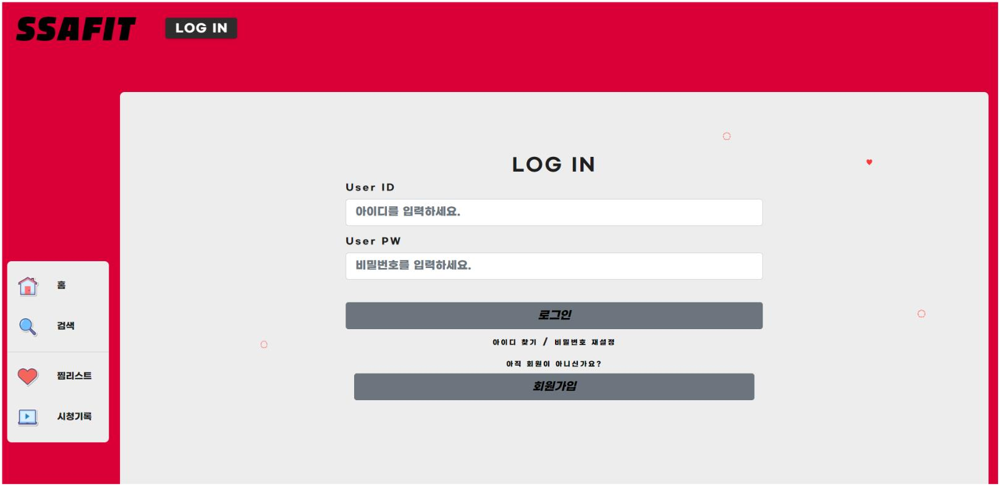
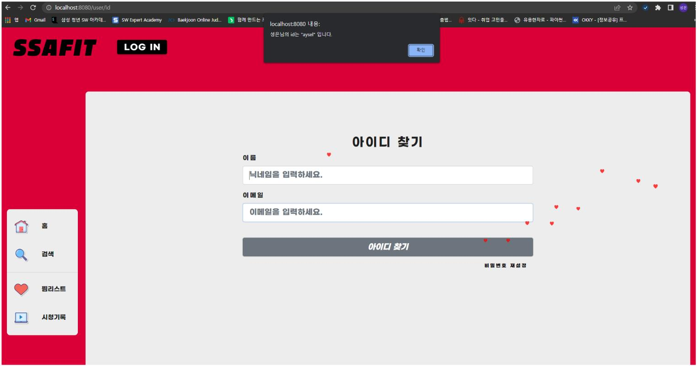
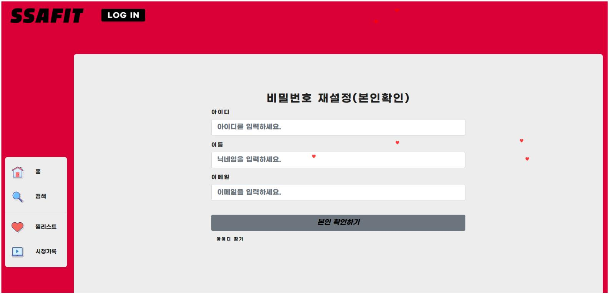
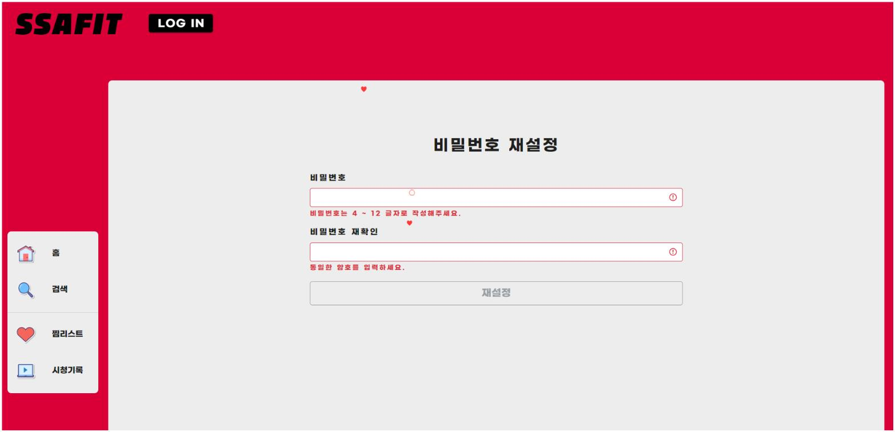
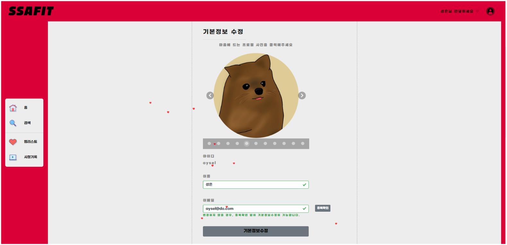
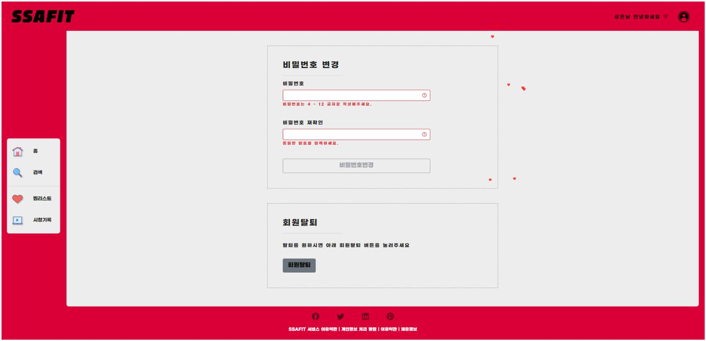

# SSAFIT
## 📌프로젝트 특징
* Spring Boot와 Vue.js를 기반으로 하는 운동 영상 리뷰 커뮤니티 웹서비스
* 프론트엔드 Repo 주소: https://github.com/CastleSilver/SSAFIT_Front
---

## 📌프로젝트 개요
* 명칭 : SSAFIT
* 개발 인원 : 6명 (Front-End: 3명, Back-End: 3명)
* 개발 기간 : 2022.05.16 ~ 2022.05.24
* 주요 기능:
    * User 관련 : JWT를 이용한 회원가입, 로그인, 아이디 및 비밀번호 찾기, 비밀번호 재설정, 회원 정보 수정
    * Video 관련 : 전체 동영상 조회, 시청 기록, 찜 기능, 추천 비디오, 운동 부위별 조회, 리뷰 평점
    * Review 관련 : 비디오 리뷰 CRUD, 리뷰 별점, 리뷰 댓글 기능
 
    
    * View : 무한 스크롤,  ... 
    
     프론트에서 기능 더 추가해야하는거 채워주세요!!!! 
* 개발 언어 : java, javascript, html, css
* 개발 환경 : springboot 2.6.7, vue.js, junit
* 데이터베이스 : mysql
* 형상관리 툴 : git

---

## 💻화면 설계
### 메인화면
1. 네비게이션 바에는 로고와 로그인 관련 버튼이 있다.
    - 비 로그인시 로그인 버튼이 활성화된다.
    - 로그인시 프로필 사진이 활성화되고, 프로필 클릭시 회원수정 로그아웃이 포함된 Dropdown 버튼이 내려온다.
    - 로고를 클릭하면 홈화면이 새로고침된다.
2. 메인 컨테이너에는 추천영상, 인기영상, 부위별 영상이 차례대로 표시된다.
    - 부위별 영상의 부위 버튼을 클릭시, 선택한 부위관련 영상만 화면에 표시된다.
    - 스크롤을 내리면 계속 다른 영상이 화면에 추가된다.
3. 사이드바에는 검색, 찜리스트, 시청기록 페이지로 넘어가는 버튼이 있다.
    - 비 로그인시 찜리스트와 시청기록 버튼을 클릭하면 로그인 페이지로 넘어간다.
4. footer에는 사이트 및 회사관련 정보가 표시된다.

### 운동 상세 화면
1. 메인화면과 동일한 네비게이션 바, 사이드 바를 포함하며 비디오 상세정보와 리뷰로 이루어진 메인 컨테이너로 구성된다.
    - 리뷰는 로그인시 작성가능하며, 별점을 필수로 입력해야한다.
    - 작성한 리뷰는 댓글 형식으로 표시된다.
    - 다른 사람이 작성한 리뷰에 답글을 추가할 수 있다.

### 찜 리스트 화면
1. 로그인한 유저가 찜한 동영상이 메인 컨테이너에 표시된다.

### 검색화면
1. 검색창과 검색한 동영상이 화면에 표시된다.
    - 검색창에 아무것도 입력하지 않을 경우 전체 동영상이 표시된다.
    - 검색창에 글씨를 입력할때마다 검색결과가 갱신된다.

### 시청기록 화면
1. 로그인한 유저가 시청한 동영상이 메인 컨테이너에 표시된다.

### 로그인 화면
1. 아이디, 비밀번호 입력 창과, 로그인, 아이디 찾기, 비밀번호 재설정, 회원가입 버튼으로 구성된다.

 

## 📂테이블 설계

#### VIDEO
|칼럼명|데이터 타입|조건|설명|
|:--:|:--:|:--:|:--:|
|`id`|`int`|`pk` `not null`|고유값|
|`video_key`|`varchar`|`not null`|비디오 키|
|`title`|`varchar`|`not null`|제목|
|`url`|`varchar`|`not null`|주소|
|`part`|`varchar`|`not null`|부위|
|`channel_name`|`varchar`|`not null`|채널명|
|`view_cnt`|`int`|`null`|조회수|

#### USER
|칼럼명|데이터 타입|조건|설명|
|:--:|:--:|:--:|:--:|
|`id`|`int`|`pk` `not null`|고유값|
|`userid`|`varchar`|`not null`|아이디|
|`nickname`|`varchar`|`not null`|닉네임|
|`pw`|`varchar`|`not null`|비밀번호|
|`email`|`varchar`|`not null`|이메일|
|`profile`|`int`|`not null`|프로필 사진 번호|

#### REVIEW
|칼럼명|데이터 타입|조건|설명|
|:--:|:--:|:--:|:--:|
|`id`|`int`|`pk` `not null`|고유값|
|`vid`|`int`|`not null`|비디오 고유값|
|`uid`|`int`|`not null`|회원 고유값|
|`rate`|`double`|`default 0`|별점|
|`content`|`text`|`not null`|리뷰 내용|
|`time`|`datetime`|`default now()`|작성 시간|
|`depth`|`int`|`default 0`|깊이|
|`re_id`|`int`|`null`|리뷰 아이디|

#### LIKES
|칼럼명|데이터 타입|조건|설명|
|:--:|:--:|:--:|:--:|
|`id`|`int`|`pk` `not null`|고유값|
|`uid`|`int`|`not null` `fk`|회원 고유값|
|`liked`|`int`|`not null` `fk`|찜한 비디오 아이디|

#### PART
|칼럼명|데이터 타입|조건|설명|
|:--:|:--:|:--:|:--:|
|`id`|`int`|`pk` `not null`|고유값|
|`part`|`varchar`||부위|

#### WATCHED
|칼럼명|데이터 타입|조건|설명|
|:--:|:--:|:--:|:--:|
|`id`|`int`|`pk` `not null`|고유값|
|`uid`|`int`|`not null` `fk`|회원 고유값|
|`watched`|`int`|`not null` `fk`|시청한 비디오 아이디|
 

## 📃API 설계
**회원**
|기능|Method|URL|Response|
|:--:|:--:|:--:|:--:|
|회원 정보 조회|GET|/user/getUser|토큰에 담겨있는 사용자 정보를 리턴한다.|
|아이디 중복 체크|GET|/join/id/{userid}|회원가입시 아이디 중복체크를 한다.|
|이메일 중복 체크|GET|/join/email/{email}|회원가입시 이메일 중복체크를 한다.|
|회원가입|POST|/join|회원가입을 한다.|
|로그인|POST|/login|로그인을 한다.|
|탈퇴|DELETE|/{userid}|회원 탈퇴를 하고, 해당 회원이 쓴 리뷰를 모두 삭제한다.|
|아이디 찾기|GET|/find-id|아이디를 찾는다.|
|비밀번호 재설정 자격 검증|GET|/change-pw/auth|비밀번호 재설정시 자격을 검증한다.|
|비밀번호 재설정|PUT|/change-pw|비밀번호를 재설정한다.|
|회원정보 수정|PUT|/info/{userid}|회원정보(이름, 이메일)을 수정한다.|

 
 

**비디오**
|기능|Method|URL|Response|
|:--:|:--:|:--:|:--:|
|전체 비디오 조회|GET|/video/all|모든 비디오의 정보를 조회한다.|
|비디오 선택|GET|/video/detail/{id}|id에 해당하는 비디오정보 및 평점, 좋아요 횟수를 보여준다.|
|시청 기록|GET|/video/watched|회원의 시청기록을 보여준다.|
|찜한 비디오|GET|/video/liked|찜한 동영상을 보여준다.|
|좋아요 클릭|POST|/video/likes|좋아요 버튼 클릭시 찜 테이블에 저장된다.|
|좋아요 취소|DELETE|/video/likes/{id}|좋아요 취소시 찜 테이블에서 삭제된다.|
|부위 종류 반환|GET|/video/part|DB에 있는 비디오의 부위 정보를 조회횐다.|
|추천 영상|GET|/video/recommended|회원별 추천 영상을 조회한다.|

 
 

**리뷰**
|기능|Method|URL|Response|
|:--:|:--:|:--:|:--:|
|리뷰 등록|POST|/review/write|리뷰를 작성한다.|
|리뷰 수정|PUT|/review/update/{id}|리뷰를 수정한다.|
|리뷰 삭제|DELETE|/review/delete/{id}|리뷰를 삭제한다.|
|비디오 전체 리뷰 조회|GET|/review/all/{id}|선택한 비디오의 전체 리뷰를 조회한다.|
|비디오 회원 리뷰 조회|GET|/review/all/{vid}/{uid}|선택한 비디오에서의 해당 회원이 작성한 리뷰를 조회한다.|
***
## 🖼️시연화면

> **로그아웃 상태일 때의 메인화면**  
> 랜덤으로 유튜브 운동 영상을 골라 추천 영상에 띄워 줍니다.
 

> **로그인 상태일 때의 메인화면**  
> 찜한 영상과 시청 기록을 기반으로 회원이 관심있어 할 동영상을 추천 동영상에 띄워줍니다.
> 프로필 사진을 누르면 드롭다운 메뉴가 나타나고 페이지를 이동할 수 있습니다.
 

> **메인화면의 영상 목록**  
> 사용자가 스크롤 할 시 사이드바가 따라 옵니다.
> 동영상 위로 커서를 올리면 해당 동영상의 썸네일이 확대되고, 동영상의 제목과 찜 버튼이 드러납니다.
> 동영상 목록 상단에는 운동 부위 버튼이 있고, 버튼을 누르면 해당 부위의 운동 영상만 나타나게 됩니다.
> 무한 스크롤을 구현하여, 방대한 양의 유튜브 영상을 가져와도 영상을 편하게 구경할 수 있는 UX를 제공합니다.
 

> **SNS 공유 기능**  
> 다양한 사람들과의 상호작용과 경험 공유를 목적으로 하는 커뮤니티 사이트의 특성을 고려하여 SNS 공유 API를 구현하였습니다.
 

> **검색화면**  
> 운동하고 싶은 부위나, 운동 기구를 검색하여 관련 영상을 찾을 수 있습니다.
> 조회수 순, 찜 많은 순, 리뷰 많은 순, 평점 많은 순으로 영상을 정렬할 수 있습니다.
 

> **회원가입**  
> 아이디 중복 체크와 이메일 중복 체크 기능을 포함한 회원가입을 구현하였습니다.
 

> **로그인**  
> JWT 토큰을 이용한 보안성과 효율성이 우수한 로그인 시스템을 구현하였습니다.
 

> **아이디 찾기**  
> 닉네임과 이메일로 자신의 아이디를 찾을 수 있습니다.
 

> **비밀번호 재설정**  
> 아이디, 이름, 이메일을 통해 본인인지 확인합니다.
> 본인인지 확인되면, 비밀번호 재설정 페이지로 이동하고 비밀번호를 재설정 할 수 있습니다.
 

> **마이 페이지**  
> 비밀번호를 통해 본인확인이 진행되면 회원정보를 수정할 수 있습니다.
> 프로필, 닉네임, 이메일, 비밀번호 변경, 회원탈퇴를 할 수 있습니다.
 

> **찜리스트**  
> 찜 버튼을 클릭하면 찜 리스트에 해당 동영상이 담기고 버튼을 다시 누르면 찜 리스트에서 삭제됩니다.
 

> **상세 페이지**  
> 상세 페이지에서는 동영상을 재생하고 별점을 주고 리뷰를 남길 수 있습니다.
> 직접적인 의견교환이 가능하도록 대댓글 기능을 구현하였습니다.
> 자신의 리뷰만 삭제할 수 있습니다.
 

> **시청 기록**  
> 시청 기록 메뉴에서 내가 시청했던 동영상들을 확인할 수 있습니다.
 
 
